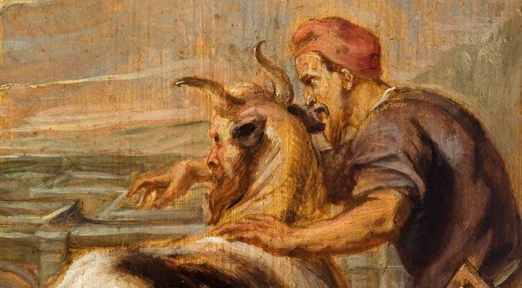

<p align="center">
  
</p>

# Daedalus Dungeon & Maze generator

Daedalus is a tool to generate mazes and dungeons, you can set dungeon & room margins, corridor size and room sizes / relativistic amount of rooms.

### Minimal example
```
extern crate daedalus;
use daedalus::Generator;

fn main() {
    let map = Generator::new().generate();
}
```

### TODO _(in order of importance)_
- Remove deadends from corridors.
- Add room shapes.
- Expand map shapes to encapsulate corridors.
- Clean up
- Add minotaur